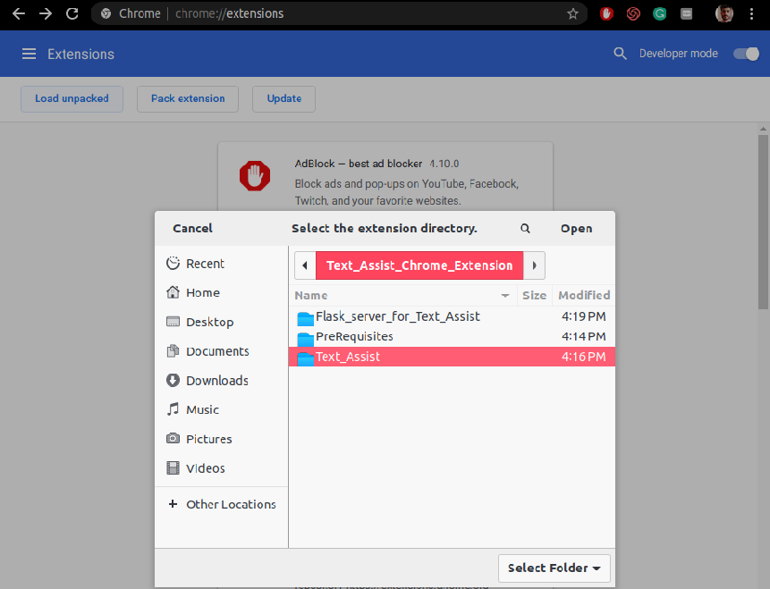
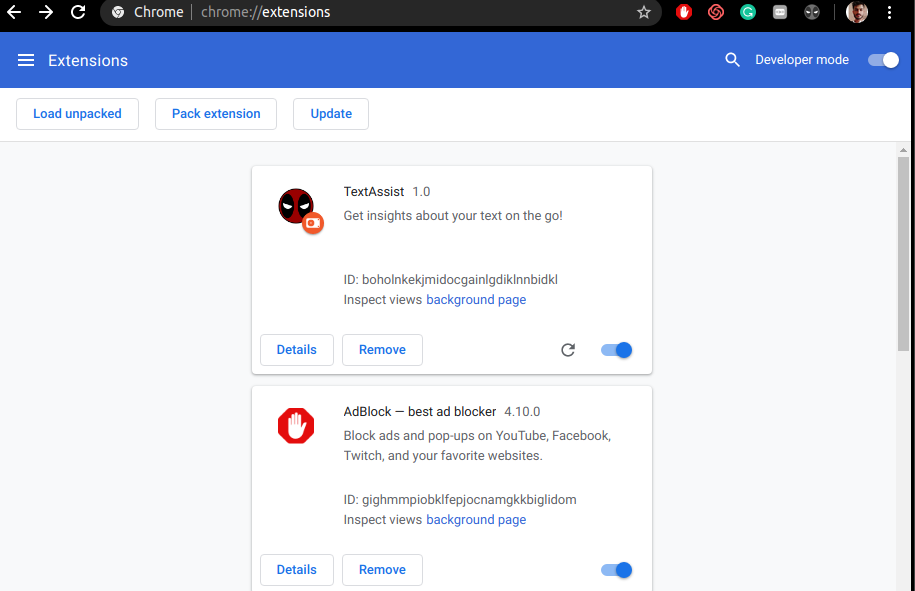
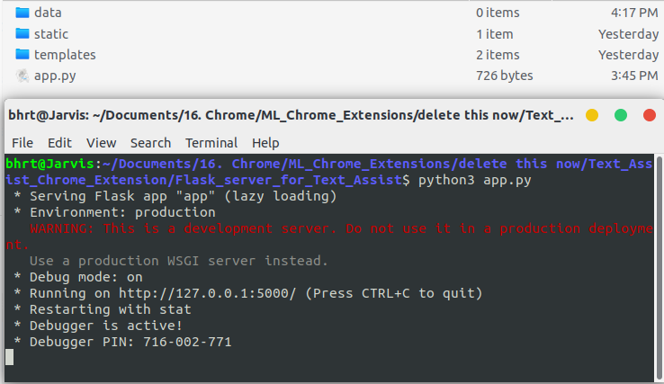
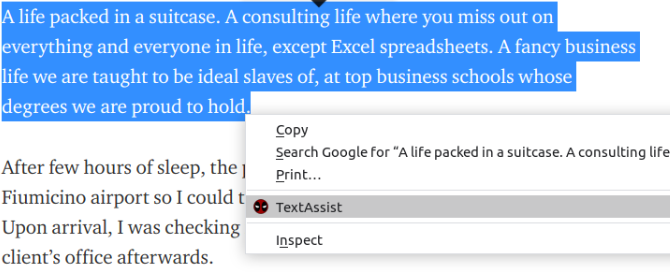
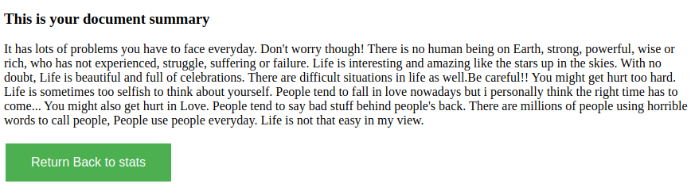

# Text Assist 1.0.0
```diff
- Please give a star if you like the repo! 
- Looking for colaboration
```
## A chrome extension to help you analyse your documents.

### Tasks

- [x] Article readability score (0-100)
- [x] Article Summary.
- [ ] Article Rewrite.
- [ ] Synonyms generator.
- [ ] Tags recommendation.
- [ ] Similar Documents over internet.

### Usage :
##### Step 1 : Clone the repository

##### Step 2 : Go to [chrome://extensions/](chrome://extensions/)
##### 2.1 : Turn on the Developer Mode
##### 2.1 : Click on Load unpacked 
##### 2.2 : Browse to the clone directory and select the "Text_Assist" Folder
##### 2.3 : Click open



##### Then you will see the loaded extension in the [chrome://extensions/](chrome://extensions/) menu



##### Step 3 : Run the local Flask server by navigating to the [Text_Assist_Chrome_Extension/Flask_server_for_Text_Assist/](https://github.com/bhrt-sharma/Text_Assist_Chrome_Extension/tree/master/Flask_server_for_Text_Assist) directory in your local environment.


#### Hurray! (if you didn't get any errors you can use the extension)

```diff
+  Step 4: So you just need to select the text on browser screen and right click to choose the extension "Text Assist" 
```



```diff
+  Step 5: You will get the results
```
#### 1) Article Redability score:


#### 2) Summary result:




###### PS : The codes in the prerequisite are inspired by "Codevolution" the YouTuber.
